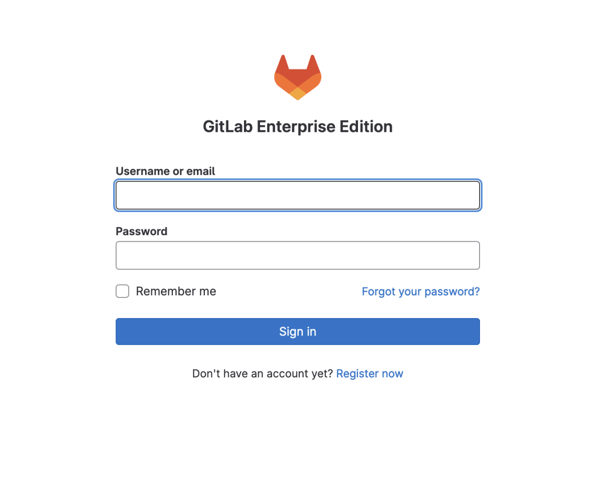

# Deploying a Self-Hosted GitLab Instance With a KVM GitLab Shared Runner on Ubuntu Linux 22.04

### Tom Dean: [LinkedIn](https://www.linkedin.com/in/tomdeanjr/)

## Introduction

For the past year or so, I've been authoring and managing content in a "homemade" hands-on labs platform, running in Amazon Web Services (AWS), with HashiCorp Terraform/Packer, using GitLab with CI/CD, and, frankly, *it has spoiled me rotten*.  

Last week, when my position was impacted in the second round of layoffs at my previous employer, one of the things I knew I was going to miss dearly (*other than my fantastic team!*) was this wonderful place to create and manage infrastructure-as-code projects.

*I guess the one great thing about periods of unemployment is the opportunity to tackle passion projects!*

After the dust settled, I realized that a great first project to soothe my soul and give me a place to create and store the coming torrent of projects and content would be a similar GitLab setup.  Being unemployed, I wanted to avoid the Cloud (*for now*) and utilize what I had on hand.  This would mean building on Ubuntu Linux 22.04, with a local, self-hosted GitLab instance, utilizing KVM/`libvirt` for a local GitLab shared runner for CI/CD operations.

In addition, the plan was to also use KVM/`libvirt` to run my local workloads, use Terraform/Ansible for automation in projects, and Packer and `virt-builder` for creating system images.  I plan to add more functionality in the future, but wanted to keep things manageable on the outset so I could get up and running in short order.

*In other words, we're going to build a "lab in a box"!*

In this tutorial, I'm not going to provide a step-by-step guide for installation, as there are many variables, depending on your environment.  I will point out the high-level considerations, where I ran into issues and will document any resources I used in this repository.

***Let's go!***

## High-Level Thinking

### Hardware

I have a **Dell Precision T5500** workstation sitting under my desk, which I recently upgraded:

- Ubuntu 22.04
- Dual six-core Xeons
- Plenty of storage
    - RAID-1 SSD for system: 250GB
    - RAID-1 HDD for data: 6TB
- Dual 1GB network connections
    - Public/General network
    - Private/Data/Application Network
- 72GB of RAM
- Decent GPU, possible future use?

The workstation was already up and running with Ubuntu 22.04, mostly idle, only serving as an NFS server at this point.  Yes, it's kind of old, but it's still a trooper, like me.

### Software

I wanted my "lab in a box" to have the following functionality:

- GitLab: *Keep it local!*
    - Place to do primary development
        - Release projects/content on GitHub
    - Local GitLab instance
    - Publically accessible (*by me*)
    - CI/CD
        - KVM/`libvirt` runner
- Terraform
    - Write automation for labs and projects
    - Execute workloads on KVM/`libvirt`
- Packer
    - Create images for projects
    - Also use `virt-builder` and Image Builder as needed
- Ansible
    - Might use in future projects, or for lab infrastructure
- Cockpit
    - Web-based server information and management
    - For when you want to treat your "lab in the box" as an appliance and skip the CLI

***Let's see how we build that!***

## KVM/`libvirt`: Install

[Ubuntu: libvirt](https://ubuntu.com/server/docs/virtualization-libvirt)

[How To Install KVM Hypervisor on Ubuntu 22.04|20.04](https://computingforgeeks.com/install-kvm-hypervisor-on-ubuntu-linux/)

[Red Hat: Getting started with virtualization](https://access.redhat.com/documentation/en-us/red_hat_enterprise_linux/8/html/configuring_and_managing_virtualization/getting-started-with-virtualization-in-rhel-8_configuring-and-managing-virtualization#enabling-virtualization-in-rhel8_virt-getting-started)

[Creating a Directory-based Storage Pool with virsh](https://access.redhat.com/documentation/en-us/red_hat_enterprise_linux/6/html/virtualization_administration_guide/sect-virtualization-storage_pools-creating-local_directories-virsh)

At the bottom of the "lab in a box" stack, our foundation, is `libvirt`.  We're going to use it to execute our project workloads, including the shared GitLab runner we use for CI/CD.

The exact set of steps required to install the KVM/`libvirt` components will vary, based on your Linux distribution.  I've included links for Ubuntu and RHEL variants above, but you should be able to Google it and get instructions.  Remember, make sure you can install GitLab on your distribution as well.  If you're using some obscure distribution, you might be out of luck.

Once you have KVM/`libvirt` installed, let's give it a test:
```
virsh --help | more
```

You should get help for the `virsh` command-line utility, which is what we use to manage our virtual machine environment.

Let's make sure we can build virtual machine images:
```
virt-builder --help
```

We will use the `virt-builder` utility to build the image for our GitLab shared runner VM.

Let's check our system for virtual machines:
```
virsh list --all
```

***We shouldn't see any virtual machines at this point, unless you have some running already, of course.  We can move on to setting up our GitLab instance.***

## GitLab: Install and Configure

### GitLab: Prerequisites

Before you jump right in and install GitLab, you will need to configure some external items:

- DNS
    - GitLab Instance
        - ex: gitlab.example.com
    - GitLab Mail
        - ex: gitlab-mail.example.com
- Port Forwarding
    - GitLab Instance
        - Port 443, or another port, for HTTPS
            - Often 443 won't be available, you can pick another
            - If you use a different one, it will be on that port on the server
            - If you're using a custom port for HTTPS, make sure to append it to the URL you configure GitLab with
        - Port 80 (for Let's Encrypt, not needed for HTTP)

I would configure both of these before installation, so you have all the values pinned down, and so everything works at installation time.  Some of this stuff is needed during installation, so proceed at your own peril without it.

If you are only going to access the instance inside your network, you can use HTTP (if you're down with that), and don't need to forward any ports.  You will still need working DNS.

Read the Installation and DNS pages before you install, from front-to-back, and you'll be fine.


### GitLab: Installation

[Install self-managed GitLab](https://about.gitlab.com/install/)

[GitLab: DNS settings](https://docs.gitlab.com/omnibus/settings/dns.html)

Follow the instructions.  Again, if you're using a custom port for HTTPS, make sure to append it to the URL you configure GitLab with, for example `https://gitlab.example.com:PORT`.  GitLab will be listening on that port on the server, so make sure you forward that external port to the same port on the server.

Once installation is complete, head over to your web browser, plug in the URL to your GitLab instance and look for the login screen as shown below.



At this point, you'll want to log in as `root`, change the default password that was supplied at installation time (*you saved that, right?*), and create a local GitLab user for yourself (and give that user Admin permissions, if desired).

Create a new project, set it up, add some code, give GitLab a workout.

***If you're not looking to do CI/CD, you can skip the next step, but I don't know why you wouldn't want to!***


### GitLab: Shared Runner: Information

[GitLab: The scope of runners](https://docs.gitlab.com/ee/ci/runners/runners_scope.html)

In order to execute our GitLab CI/CD jobs, we're going to need a runner.  I've decided to use KVM/`libvirt` as the environment to "*run my runner*", and followed the instructions in the GitLab docs referenced below.

If you'd like to know more about GitLab runners, check out the link above.


### GitLab Shared Runner: Configure KVM Runner Instance

[Using libvirt with the Custom executor](https://docs.gitlab.com/runner/executors/custom_examples/libvirt.html)

[Install GitLab Runner](https://docs.gitlab.com/runner/install/)

Before we can launch a runner, we'll need to build a virtual machine image for our runner.  We're going to use `virt-builder`, as specified in the **"Using libvirt with the Custom executor"** instructions above.  You can follow the documents like I did, and should get a good result.  I have included assets and scripts in this repository to speed up deploying the `libvirt-driver` (`install-libvirt-driver.sh`) and building the runner image (`runner-builder.sh`).  Feel free to use them if you'd like.

#### If you'd like to use the scripts, do the following:

Clone this GitHub repository.  From the root of the repository:

Deploy `libvirt-driver`:
```bash
sudo ./install-libvirt-driver.sh
```

This will create the `/opt/libvirt-driver` directory, copy the `libvirt-driver` scripts to it and set permissions and ownership for the scripts.

You should see a result similar to this:
```bash
tdean@monolith:~$ ls -al /opt/libvirt-driver/
total 24
drwxr-xr-x 2 root root 4096 Feb 20 20:56 .
drwxr-xr-x 4 root root 4096 Feb 20 20:55 ..
-rwxr-xr-x 1 root root  435 Feb 20 20:55 base.sh
-rwxr-xr-x 1 root root  364 Feb 20 20:56 cleanup.sh
-rwxr-xr-x 1 root root 1570 Feb 20 20:55 prepare.sh
-rwxr-xr-x 1 root root  452 Feb 20 20:56 run.sh
```

Next, we'll build the GitLab shared runner, using the script.  You should replace **<<ROOT_PASSWORD>>** with your desired `root` password for your shared runner virtual machine.  If you'd like to have `virt-builder` assign a random password, edit the script and make changes as described in the comments in the script.

Build shared runner image:
```bash
sudo ./runner-builder.sh <<ROOT_PASSWORD>>
```

You will use the `/opt/libvirt-driver/prepare.sh` script to launch your shared runner virtual machine.  Once the shared runner is up, you can check its status with:
```bash
virsh list --all
```

You should see something similar to the following:


You will need to log in to the shared runner instance using `virsh-console`:
```bash
virsh console <<instance_name>>
```

For example:
```bash
virsh console runner--project--concurrent--job-
```

You will log in as `root`, using the password you set when you build the shared runner image.

Once you're logged in, you will want to edit `/etc/gitlab-runner/config.toml` and replace the contents with the configuration below.  Replace the URL with your URL, and you will put the token we're going to get in the next step in as the token value, so keep this open after you've pasted and saved the contents.  I've also provided this in a file in the repository (`config.toml`) if you'd like to use that.

Contents of `/etc/gitlab-runner/config.toml`:
```bash
iconcurrent = 1
check_interval = 0

[session_server]
  session_timeout = 1800

[[runners]]
  name = "libvirt-driver"
  url = "https://gitlab.example.com:PORT/" # Edit to match your URL, with PORT if non-standard
  token = "xxxxx" # Edit to use the token your GitLab instance provides for your shared runner
  executor = "custom"
  builds_dir = "/home/gitlab-runner/builds"
  cache_dir = "/home/gitlab-runner/cache"
  [runners.custom_build_dir]
  [runners.cache]
    [runners.cache.s3]
    [runners.cache.gcs]
  [runners.custom]
    prepare_exec = "/opt/libvirt-driver/prepare.sh" # Path to a bash script to create VM.
    run_exec = "/opt/libvirt-driver/run.sh" # Path to a bash script to run script inside of VM over ssh.
    cleanup_exec = "/opt/libvirt-driver/cleanup.sh" # Path to a bash script to delete VM and disks.
```

***Let's go ahead and register our shared runner with our GitLab instance!***


### GitLab Shared Runner: Register Your Shared Runner

[GitLab: Registering runners](https://docs.gitlab.com/15.7/runner/register/)

In order to utilize our shared runner, we must register it with our GitLab instance.  As a GitLab Administrator, go to the **Admin Area**, then choose **CI/CD --> Runners**.  You will see a blue drop-down menu in the upper right hand area of the screen, **Register an instance runner**.  Click on this to drop down the menu shown below, and select **Show runner installation and registration instructions**.


Get the <<URL>> and <<TOKEN>> information, then hop back to the GitLab runner, and as `root`, run:

```bash
gitlab-runner register --url <<URL>> --registration-token <<TOKEN>>
```

Replace the <<URL>> and <<TOKEN>> vaules with your values.  Follow the prompts and provide the proper answers based on your configuration.  When the process is complete, you should see the shared runner appear (after a short delay, possibly).


If you have any projects you'd like to enable your shared runner for, navigate to the projects, go to **Settings --> CI/CD** and then choose **Expand** in the **Runners** section.  You can enable and check the status of shared runners for that project here.


We're not going to dive into CI/CD and shared runners right now, but if you know all that stuff, feel free to test and debug your runnner now.

***With GitLab and the shared runner installed, configured and working, the bulk of the work is done.  Let's finish the rest!***


## Terraform/Packer: Install

[Hashicorp: Official Packaging Guide](https://www.hashicorp.com/official-packaging-guide)

[Install Terraform](https://developer.hashicorp.com/terraform/tutorials/aws-get-started/install-cli)

[Install Packer](https://developer.hashicorp.com/packer/tutorials/docker-get-started/get-started-install-cli)

I've written quite a bit of infrastructure-as-code in Terraform, using AWS, for lab environments and projects in the past, so I decided to try my hand with Terraform + KVM/`libvirt` to provide IaC automation for my projects.

I've also used Packer to build AMIs in the past, so I installed it, for when I start building in the Cloud.  I might explore using it to build local VM images.  For now, I've been using `virt-builder`.

To install these, you first need to add the repositories for Hashicorp, as described in the link above.  Follow the steps for your operating system.  Once the repositiories have been added, you can install Terraform and Packer as instructed in the links above.

You can verify your installation by checking the versions of Terraform and Packer:
```
terraform --version
```
```
packer --version
```

You should get the installed versions back.


## Ansible: Install

[How To Install and Configure Ansible on Ubuntu 22.04](https://www.digitalocean.com/community/tutorials/how-to-install-and-configure-ansible-on-ubuntu-22-04)

While you might not opt for it, at some point I figure I might need it, so I installed Ansible.  If you're not using Ubuntu, your procedure will be different.  It's pretty well-documented, so Google it.

Install Ansible repository for Ubuntu:
```
sudo apt-add-repository ppa:ansible/ansible
```

Install Ansible:
```
sudo apt-get update ; sudo apt install -y ansible
```

Again, totally optional, and if you're using a platform other than Ubuntu, follow the proper steps.  I'm not going to configure Ansible at this point, as it's a future project.


## Cockpit: Install/Configure

[Running Cockpit](https://cockpit-project.org/running)

Like I said above, sometimes you want to treat your "lab in the box" as an appliance and skip the CLI, so having the option to use Cockpit for system monitoring and administration is nice.  We can install Cockpit with a single command, and a quick configuration change.

For Ubuntu (22.04):
```
sudo apt-get update ; sudo apt-get install -y cockpit
```

Since GitLab is using the default Cockpit web interface port of `9090`, we need to change that.  I made it `8090` by editing the `/lib/systemd/system/cockpit.socket` file and changing it there.

Edit `/lib/systemd/system/cockpit.socket`:
```
sudo vi /lib/systemd/system/cockpit.socket
```

Like this:
```
[Socket]
ListenStream=8090
```

Next, you will need to reload the `systemd` unit files to pick up the changes:
```
sudo systemctl daemon-reload
```

Now, we can restart the `cockpit.socket` and `cockpit.service` units:
```
sudo systemctl restart cockpit.socket ; sudo systemctl restart cockpit.service
```

And check the status of Cockpit:
```
sudo systemctl status cockpit
```

Now you can log in to Cockpit at `https://yourhostname:8090`.


You should be able to log in as `root`, or another local user, and should get the dashboard as seen above.

***That's it!***


## Summary

In this tutorial, we created a "lab in a box" to host a local GitLab instance with CI/CD runner,levearging KVM/`libvirt` for our own "private cloud", Terraform/Packer/Anisible for automation/builds and Cockpit for a GUI management interface.  This should give us a great place to develop and test code, especially Infrastructure-as-Code projects.

Enjoy!

***Tom Dean***
